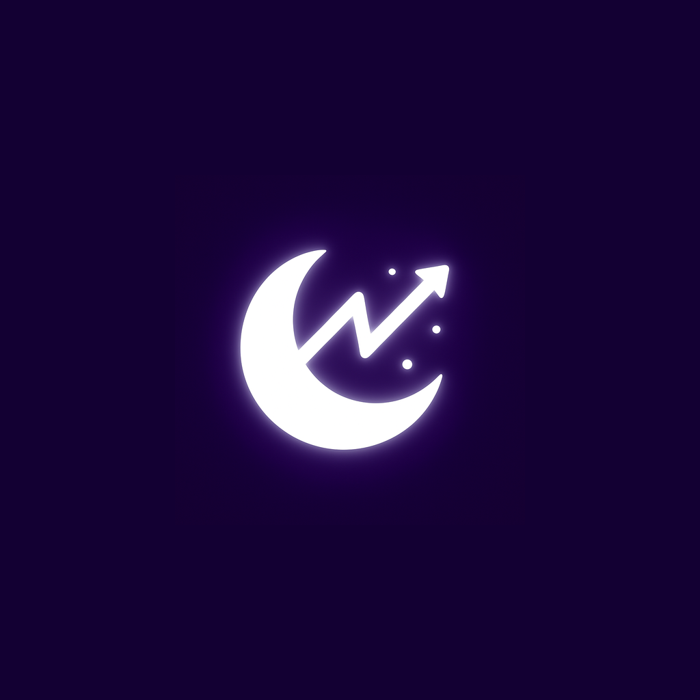

# Midnight Momentum

  
  
  **Connect to Your Better Self**
  
  ([midnightmomentum.up.railway.app](https://midnightmomentum.up.railway.app/))

---

## About

Midnight Momentum is a mental wellness application designed to help users stay connected to their goals and aspirations. The app provides three core features:

- **Moments** - Capture inspirational content with intelligent reminders
- **Mood** - Track emotional patterns with AI-powered insights  
- **Eva** - Personalized AI wellness companion

## Technology Stack

**Mobile Application**
- Frontend: React Native
- Platforms: iOS & Android

**Backend**
- Framework: Python Flask
- Database: PostgreSQL
- AI Integration: Finetuned Model | Gemini 

**Website**
- Node.js + Express
- Deployed on Railway

## Project Status

Currently in active development. This repository contains the landing page and website assets.

---

## Contact

- Website: ([midnightmomentum.up.railway.app](https://midnightmomentum.up.railway.app/))
- Email: obaiazed@gmail.com

---

© 2025 Midnight Momentum. All rights reserved.
