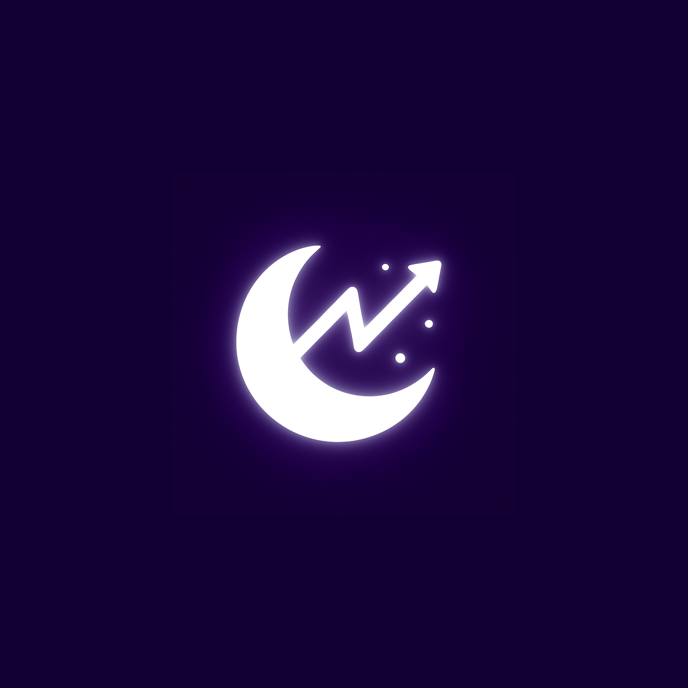

  

  <h1>Midnight Momentum</h1>

  
<em>Connect to Your Better Self</em>

  <a href="https://midnightmomentum.com">midnightmomentum.com</a>

   
   

  
  
  
  

---

## About

Midnight Momentum is a mental wellness app that helps users stay connected to their goals and aspirations — one moment at a time.

## Features

| Feature | Description |
|--------|-------------|
| **Moments** | Capture inspirational content with intelligent reminders |
| **Mood** | Track emotional patterns with AI-powered insights |
| **Eva** | Personalized AI wellness companion — [view repository →](https://github.com/Omar11N/EVA-Chatbot_MidnightMomentum) |

## Tech Stack

**Mobile**
- React Native — iOS & Android

**Backend**
- Python Flask · PostgreSQL
- AI: Finetuned Model + Gemini

**Website**
- Node.js + Express · Deployed on Railway

## Project Status

Active development. This repository contains the landing page and website assets.

For the Eva AI companion module, see the [EVA-Chatbot repository](https://github.com/Omar11N/EVA-Chatbot_MidnightMomentum).

---

## Contact

- 🌐 [midnightmomentum.up.railway.app](https://midnightmomentum.up.railway.app/)
- 📧 [obaiazed@gmail.com](mailto:obaiazed@gmail.com)

---

  © 2025 Midnight Momentum. All rights reserved.

